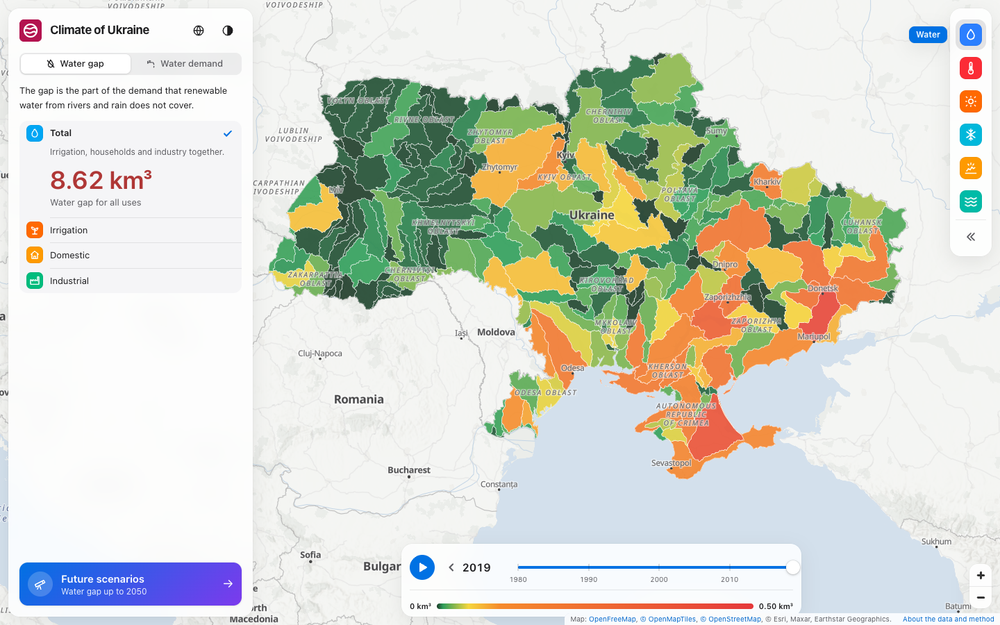

# Climate of Ukraine — Past and Future

An interactive map of changes in Ukraine's climate and water resources: observations since 1950 and projections to the end of the 21st century based on climate and hydrological models.

**Live demo:** https://olede-dev.github.io/climate-ua/



## Features

- Six thematic layers at the level of oblasts, sub-basins and river gauging stations.
- A single timeline covering both the historical period and the projections.
- Region card: a past–present–projection comparison, a chart for the full period, and the Köppen–Geiger climate type today and in the future.
- River mode: 10 GloFAS stations coloured by today's water state, the long-term flow trend or yearly low-flow days, with a daily timelapse; a sortable station list with a basin filter; a station card with the discharge chart, the 7-month ensemble forecast, a forecast badge, precipitation and CSV export.
- Interface state (layer, period, region, station, basin, chart settings) is stored in the URL.
- Ukrainian and English interface.

## Data layers

| Layer | Spatial unit | Observations | Projections |
|---|---|---|---|
| Water deficit and demand, km³ | 265 sub-basins | 1980–2019 | Deficit: 2021–2035, 2036–2050 (SSP1-2.6, SSP3-7.0, SSP5-8.5) |
| Temperature anomaly relative to 1991–2020 | 25 oblasts | 1950–2025 | 2021–2040, 2041–2060, 2081–2100 (SSP2-4.5) |
| Days with maximum above 35 °C | 25 oblasts | 1950–2025 | 2021–2040, 2041–2060, 2081–2100 (SSP2-4.5) |
| Days with minimum below 0 °C | 25 oblasts | 1950–2025 | 2021–2040, 2041–2060, 2081–2100 (SSP2-4.5) |
| Drought: months with SPEI-6 below −1 | 25 oblasts | 1950–2025 | 2021–2040, 2041–2060, 2081–2100 (SSP2-4.5) |
| River low flow relative to the 1997–2020 norm | 10 gauging stations | 1997–2025 | — |

## Methodology

Projections use the delta method: the change derived from the CMIP6 model ensemble is added to the observed climatology. Climate indicators are averaged over 20-year periods and water indicators over 15-year periods. The map shows the ensemble median by default (the mean for water layers); the lower and upper bounds of the model range are also available.

### River mode

River data are **model output, not gauge observations**: GloFAS v4 on a ~5 km grid. The norm is 1997–2020: for each day of the year, p10, p25, median, p75 and p90 of every value within ±3 days. Today's discharge Q (Kyiv time) is classed against the norm for that day:

| Water state | Condition |
|---|---|
| Very low water | Q < p10 |
| Low water | p10 ≤ Q < p25 |
| Near normal | p25 ≤ Q ≤ p75 |
| Above normal | p75 < Q ≤ p90 |
| High water | Q > p90 |

The forecast badge appears when the ensemble median leaves p10–p90 within the next 30 days, with the first such date. A low-flow day is a day below that day's p10.

Today's discharge, the forecast and precipitation are the only live data on the site: the rivers layer requests them from Open-Meteo in the browser (`docs/adr/live-river-data.md`). The map paints first from a daily snapshot built in CI and falls back to it, with a dated notice, if Open-Meteo is unavailable.

Limits:

- The API returns the largest river in each 5 km cell, so every station's cell was chosen and checked by its mean flow (`pipeline/fetch_rivers.py`). The marker sits on the river line; the data belong to the cell centre.
- The norm comes from the reanalysis, while recent weeks and today come from archived GloFAS operational forecasts, so the comparison is approximate.
- Precipitation is a point value at the station, not a catchment mean, and is forecast for 16 days.
- Dams regulate the Dnipro at Kyiv; its low-flow days say less about climate than other stations do.

The full methodology is described in the "About the data and methodology" section of the site.

## Tech stack

- **Frontend:** Vue 3, TypeScript, Vite, Pinia, TanStack Query, MapLibre GL, Chart.js, Tailwind CSS v4.
- **Testing:** Vitest.
- **Data processing:** Python (xarray, geopandas, rasterio), environment managed with [uv](https://docs.astral.sh/uv/).
- **Deployment:** GitHub Pages via GitHub Actions on every push to `main` and daily, to refresh the river snapshot.

## Running locally

```bash
npm install
npm run dev
```

Checks run in CI:

```bash
npm run lint && npm test -- --run && npm run build
```

## Data pipeline

Apart from the live river data above, the application is static: its data lives in `public/data/` and is committed to the repository. It is generated by the pipeline in `pipeline/`, which is run manually for the annual update. The one exception, `public/data/discharge-snapshot.json`, is not committed: CI builds it with `npm run build:river-snapshot` before every deploy and daily.

Prerequisites: a [Copernicus CDS](https://cds.climate.copernicus.eu/) account, an API key in `~/.cdsapirc`, and an accepted licence for the [C3S Atlas](https://cds.climate.copernicus.eu/datasets/multi-origin-c3s-atlas) dataset.

```bash
cd pipeline
uv run python build_oblasts.py     # oblast boundaries → public/data/oblasts.geojson
uv run python fetch_atlas.py       # ERA5 and CMIP6 → pipeline/data/raw
uv run python build_climate.py     # → public/data/layers/{temp,heat,frost,drought}.json
uv run python fetch_wwm_basins.py  # World Water Map basins and projections (ArcGIS)
uv run python build_basins.py      # → public/data/basins.geojson
uv run python build_water_use.py   # → public/data/water-use.json
uv run python fetch_koppen.py      # Köppen–Geiger maps (~130 MB)
uv run python build_koppen.py      # → public/data/koppen.json
uv run python fetch_rivers.py      # GloFAS v4 via Open-Meteo; fails if a cell holds the wrong river
uv run python build_rivers.py      # → public/data/{rivers,river-norms}.json
uv run python build_river_lines.py # → public/data/river-lines.geojson (after build_oblasts.py)
```

Raw downloads are stored in `pipeline/data/raw/` and are not committed.

## Data sources

- **Water resources:** PCR-GLOBWB 2 model, Utrecht University (Sutanudjaja et al., 2018), as published in [World Water Map](https://worldwatermap.nationalgeographic.org/) (National Geographic Society); HydroBASINS level 7 sub-basins. Data: [doi:10.24416/UU01-0Q6SU6](https://doi.org/10.24416/UU01-0Q6SU6), CC BY 4.0.
- **Climate:** [Copernicus Interactive Climate Atlas](https://atlas.climate.copernicus.eu/) (C3S / ECMWF; ERA5, CMIP6), CC BY 4.0.
- **Köppen–Geiger classification:** [Beck et al. (2023)](https://doi.org/10.1038/s41597-023-02549-6), *Scientific Data* 10, 724, CC BY 4.0.
- **River discharge:** GloFAS v4 reanalysis and ensemble forecast (Copernicus Emergency Management Service) via the [Open-Meteo Flood API](https://open-meteo.com/en/docs/flood-api).
- **Precipitation at river stations:** [Open-Meteo Forecast API](https://open-meteo.com/en/docs).
- **Administrative boundaries:** [geoBoundaries](https://www.geoboundaries.org/) (© OpenStreetMap, ODbL); land polygons from [Natural Earth](https://www.naturalearthdata.com/).
- **Basemap:** [OpenFreeMap](https://openfreemap.org/), © OpenMapTiles, © OpenStreetMap.

## License

The code is released under the [MIT License](LICENSE). The data in `public/data/` comes from external sources and is distributed under their respective licenses (see [Data sources](#data-sources)).
